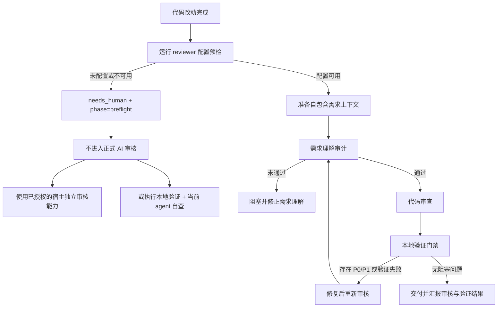

# code-review-loop 技能介绍
为什么需要：编码 agent 写完代码后自己判断是否正确，容易受到上下文和自我确认偏差影响。我们还经常遇到需求理解跑偏、测试没有真正执行、大改动跨文件风险漏审等问题。

## 目录

- [定位](#1-定位)
- [它解决什么问题](#2-它解决什么问题)
- [核心原理](#3-核心原理)
- [严重级别](#4-严重级别)
- [三种审查结论](#5-三种审查结论)
- [标准用法](#6-标准用法)
- [产物与安全](#7-产物与安全)
- [什么时候不使用](#8-什么时候不使用)
- [团队落地建议](#9-团队落地建议)
- [关键文件速查](#10-关键文件速查)
- [一页纸总结](#11-一页纸总结)

## 1. 定位

`code-review-loop` 是一个**本地 AI 代码审查闭环**：它把"当前 Git 改动 + 需求上下文 + 项目规则"打包成一份自包含的审查简报，交给一个独立的 AI 审查模型产出结构化结论；当前编码 agent 负责根据结论修复、验证并重新跑审查，直到没有阻塞性问题为止。

核心区别于"让 AI 顺手看一眼代码"：

- 审查模型**不直接改文件**，只返回结构化 findings；
- 当前编码 agent **不能只因为 AI 说 pass 就交付**，还要同时汇报本地验证命令的结果；
- `--verify` 里任何命令退出码非零，工具会**确定性**地把最终结论抬升为 `fail`，不指望模型自己发现验证失败。

什么场景使用

- 使用 Codex、Claude Code、OpenCode 等编码 agent 的开发者；
- 希望把 AI 代码审查纳入本地开发或提交前流程的团队；
- 关心审查可重复、可追溯，以及需求理解偏差的技术负责人。

---

## 2. 它解决什么问题

| 没有 code-review-loop | 有了 code-review-loop |
|---|---|
| AI 写完代码自己说"看起来没问题"就交付 | 独立模型按 schema 审查，结论可结构化、可追溯 |
| 需求理解跑偏了，到测试阶段才发现 | 先跑**需求理解闸门**，理解不忠实直接拦截 |
| 大改动一次塞给模型，经常漏看跨文件风险 | `--profile auto` 自动分片 + 汇总审查，专查跨分片集成风险 |
| 审查通过但 lint/test 没跑 | `--verify` 强制门禁，验证失败直接 fail |
| 同一个问题反复出现，没有轮次追踪 | 按请求指纹记录连续未通过轮次，超限交还人工 |
| 单模型盲点 | 支持双模型（主审 + 二审），auto 模式按阈值触发 |

---

## 3. 核心原理

### 3.1 总体流程



最关键的边界是：**没有显式配置 reviewer，不等于审核通过，也不应该进入需求理解审计和代码审核。**此时工具只报告审核能力未就绪，并按宿主能力降级。

### 3.2 两阶段审查

正式非 `dry-run` 命令会先执行 reviewer 配置预检；只有审核能力就绪后，才进入下面两个阶段：

1. **需求理解审计**：用 `references/requirement-auditor-prompt.md`，只判断"当前 agent 对需求的理解"是否忠实反映了用户原始请求、后续纠正和明确反例。
   - 返回 `fail` 或 `needs_human` → 跳过代码审查，直接按阻塞语义退出。
   - 返回 `pass` → 结果被缓存（上下文/提示词/模型不变时复用），继续下一步。
2. **代码审查**：用 `references/reviewer-prompt.md`，按 schema 产出 `verdict` + `blocking_findings` + `warnings` + `confidence`。

为什么要先审需求？因为**代码写得再漂亮，需求理解错了也是错的**。这一步把"理解偏差"从下游测试阶段提前到提交前。

### 3.3 角色分离

| 角色 | 谁来扮演 | 做什么 |
|---|---|---|
| 审查模型 | 独立 LLM（DeepSeek、OpenAI、GLM、本地 CLI 等） | 只读 brief，返回结构化 findings，**不碰文件** |
| 编码 agent | 当前正在干活的 Claude Code / OpenCode / Codex | 写上下文、跑验证、修复 P0/P1、重跑审查、汇报结果 |
| 人工 | 团队成员 | 处理 `needs_human`、达到最大轮次后的剩余阻塞问题 |

这种分离让审查模型保持"独立第三方"视角，不会因为自己写过这段代码就护短。

### 3.4 自包含上下文

审查模型看不到对话历史。每次正式审查前，必须用 `write-review-context.mjs` 写入 `.ai-review/review-context/current-request.md`，包含：

- `request`：用户原始请求（不是摘要，不是编号引用）
- `corrections`：用户后续纠正
- `understanding`：当前 agent 的理解（待审计，不是既定事实）
- `anti-examples`：用户明确否定的行为
- `design`：设计决策和权衡
- `acceptance`：可验证的验收标准
- `non-goals`：明确不做什么
- `verification`：应该通过的验证命令

这条规则是**不可妥协的**：没有这个文件，非 dry-run 审查拒绝运行。

### 3.5 闭环与轮次

```
写上下文 → 跑验证 → 跑审查 ──┐
                            │
                ┌─ pass ────┴─→ 交付（还要汇报验证结果）
                │
                └─ fail ──→ 修复 P0/P1 → 重新验证 → 重新审查
                                          │
                                          └─ 达到最大轮次 → 交还人工
```

- 每次正式审查算一轮，按请求上下文指纹持久化连续未通过轮次。
- 默认最多 3 轮，可通过 `AI_REVIEW_MAX_REVIEW_ROUNDS` 或 `--max-review-rounds` 配置，`infinity` 表示不设上限。
- `pass` 后自动清零；新请求上下文自动开始新闭环。
- 必要时用 `--reset-review-rounds` 显式重置。

### 3.6 自动策略

`--profile auto` 是标准入口，不需要手动选策略：

- **小/中型改动**：一次代码审查。
- **大型改动**：按变更文件自动拆成并行分片（默认最多 4 片，`--max-shards` 可调），分片完成后再追加一次汇总审查，专查跨分片集成风险、需求覆盖缺口和遗漏的 P0/P1。

运行期间进度写入 `.ai-review/latest-status.md`，终端持续打印 heartbeat。

### 3.7 双模型（可选）

主审 + 二审，二审模式：

| 模式 | 行为 |
|---|---|
| `always` | 配置存在且凭证可用时强制运行二审 |
| `auto`（默认） | 主审 P0/P1/P2 达阈值或 confidence 低于阈值时才触发二审 |
| `off` | 完全关闭二审 |

两个模型都成功时合并结果；任一发现 P0/P1 都阻塞；任一失败/超时时降级用已成功模型的结果并记录原因。

---

## 4. 严重级别

| 级别 | 含义 | 是否阻塞 |
|---|---|---|
| P0 | 严重破坏、安全漏洞、数据丢失、无法构建/运行 | 是 |
| P1 | 高概率用户可见 bug、需求遗漏、行为回归、集成损坏 | 是 |
| P2 | 非阻塞质量问题 | 否 |
| P3 | 轻微改进建议或样式提醒 | 否 |

默认只有 P0 和 P1 视为阻塞，除非用户另有要求。

---

## 5. 三种审查结论

- `pass`：没有阻塞问题，可能仍带 warnings。
- `fail`：存在 P0/P1，必须修复后才能交付。
- `needs_human`：需要人工介入。可能是上下文不足、需求冲突或模型无法安全判断；也可能是 reviewer 配置预检失败。

配置预检失败时，应结合 `reviewer_failures.phase=preflight` 判断。它表示**正式审核没有运行**，不是“模型审过但无法判断”。

---

## 6. 标准用法

### 6.1 最小可跑示例

```bash
# 1. 预检 reviewer 配置
node .agents/skills/code-review-loop/scripts/ai-review.mjs --check-config

# 2. 写需求上下文（必须自包含）
node .agents/skills/code-review-loop/scripts/write-review-context.mjs \
  --request "用户原始请求" \
  --corrections "后续纠正，没有写无" \
  --understanding "当前理解" \
  --anti-examples "明确否定的行为，没有写无" \
  --design "设计决策" \
  --acceptance "验收标准" \
  --non-goals "不做的事" \
  --verification "git diff --check && npm test"

# 3. 确认有改动
git status --short

# 4. 跑审查
node .agents/skills/code-review-loop/scripts/ai-review.mjs --profile auto --verify "git diff --check"
```

如果配置预检失败，不进入需求理解审计、代码审核或轮次计数。优先使用宿主中已显式授权且能够独立返回可核验结论的审核能力；若不存在，再执行确定性本地验证和当前 agent 自查。必须明确报告本工具的独立 AI reviewer 未运行，不要把降级检查视为 AI 审核通过。本地 `codex`、`claude`、`opencode` reviewer 必须显式配置，不会根据已安装命令或 provider 专属 API key 被静默选择。

### 6.2 常用命令速查

```bash
# 只预检 reviewer 配置
node .agents/skills/code-review-loop/scripts/ai-review.mjs --check-config

# 标准入口（自动选策略）
node .agents/skills/code-review-loop/scripts/ai-review.mjs --profile auto --verify "git diff --check"

# 只看 brief 不调用模型
node .agents/skills/code-review-loop/scripts/ai-review.mjs --dry-run

# 限定路径
node .agents/skills/code-review-loop/scripts/ai-review.mjs --profile auto --path src --verify "git diff --check"

# 审查暂存区（提交前）
node .agents/skills/code-review-loop/scripts/ai-review.mjs --staged --verify "git diff --cached --check"

# 启用第二审查员
node .agents/skills/code-review-loop/scripts/ai-review.mjs --second-provider openai --second-model gpt-5.5

# 启用 CodeGraph 影响分析（best-effort）
node .agents/skills/code-review-loop/scripts/ai-review.mjs --profile auto --codegraph --verify "git diff --check"

# 强制重跑需求审计
node .agents/skills/code-review-loop/scripts/ai-review.mjs --no-requirement-audit-cache --verify "git diff --check"

# 重置连续未通过轮次
node .agents/skills/code-review-loop/scripts/ai-review.mjs --reset-review-rounds --verify "git diff --check"

# 一键清理可重新生成的产物
node .agents/skills/code-review-loop/scripts/ai-review.mjs --clean
```

### 6.3 最小配置（.env）

API reviewer 示例：

```env
AI_REVIEW_PRIMARY_PROVIDER=openai-compatible
AI_REVIEW_PRIMARY_MODEL=<model-id>
AI_REVIEW_PRIMARY_BASE_URL=https://review-gateway.example.com/v1
AI_REVIEW_PRIMARY_API_KEY=<key>
AI_REVIEW_TRANSPORT=openai-compatible
AI_REVIEW_API_STYLE=chat
```

本地 CLI reviewer 示例：

```bash
node .agents/skills/code-review-loop/scripts/ai-review.mjs --check-config --local-cli codex
```

支持已登记 API provider、任意显式配置的 OpenAI-compatible 端点，以及本地 `claude` / `opencode` / `codex` CLI。不会根据已安装命令、provider 专属 API key 或 legacy `defaultProvider` 静默选择 reviewer。完整配置见 `references/configuration.md`。

---

## 7. 产物与安全

`.ai-review/` 下会生成：

| 产物 | 作用 | 清理策略 |
|---|---|---|
| `review-context/` | 请求上下文（人工/agent 写入） | 不自动清理 |
| `latest-brief.md` / `latest-result.json` / `latest-report.md` | 最近一次审查 | 每次覆盖 |
| `latest-status.*` | 进度状态 | 每次覆盖 |
| `shards/` | 分片 brief | 每次运行开始时重建 |
| `cache/` | 需求审计缓存、轮次状态、文件上下文缓存 | 逐条过期 |
| `runs/` + `history.*` | 历史运行 | 受 `AI_REVIEW_HISTORY_LIMIT` 控制，默认保留 5 条 |

**安全要点**：

- `.ai-review/` 下产物应按**本地敏感信息**处理，不要上传到公开位置。
- 内置脱敏只覆盖常见 key 形态，**不是完整 DLP**。
- 不要提交包含真实 API key 的 `.env`。
- CLI 命令只能来自可信配置。

---

## 8. 什么时候**不**用

按 AGENTS.md 约定，以下改动**不触发** code-review-loop：

- 纯文档
- 纯格式
- 纯注释
- 纯错字
- 锁文件
- 生成产物
- `.ai-review/` 工件本身
- 仅依赖版本变更

这些改动没有代码语义变化，跑一轮审查只会浪费 token。

---

## 9. 使用落地建议

### 9.1 推荐工作流

1. **开发阶段**：功能切片完成后，先跑 `npm test` / `npm run lint` 等本地验证。
2. **提交前**：跑 `--staged --verify "git diff --cached --check"`，确保暂存区改动通过审查。
3. **高风险改动**：启用双模型 + `--profile auto`，让脚本自动升级为分片 + 汇总审查。
4. **PR 前**：跑一次完整审查，把 `.ai-review/latest-report.md` 作为 PR 描述的审查证据附件（注意脱敏）。

### 9.2 配置策略

- **常规开发**：单模型 + `auto` profile，3 轮上限。
- **提交前自动审查**：主审使用团队显式配置的模型，二审使用另一家或另一类独立 reviewer，`auto` 模式按阈值触发二审。
- **企业内部网关**：用 `openai-compatible` provider 指向内部网关。

### 9.3 常见误区

| 误区 | 正解 |
|---|---|
| "AI 说 pass 就可以交付了" | 还要汇报本地验证命令和结果 |
| "把整个对话历史发给审查模型就行" | 审查模型看不到对话，必须写自包含上下文 |
| "需求理解审计很烦，能不能跳过" | 它是防止"代码写对了但需求理解错了"的第一道防线，不要跳 |
| "大改动手动分片更可控" | `--profile auto` 会自动分片 + 汇总，手动分片容易漏跨文件风险 |
| `--relaxed-output` 默认开更快 | 严格模式才是门禁可靠性的保证，只在旧模型无法返回完整 schema 时才放宽 |

---

## 10. 关键文件速查

| 文件 | 作用 |
|---|---|
| `SKILL.md` | skill 入口说明，不可妥协的规则 |
| `references/workflow.md` | 完整工作流与命令目录 |
| `references/configuration.md` | 模型、env、双模型、CLI 参数配置 |
| `references/provider-config.md` | provider 配置细节 |
| `references/scripts-overview.md` | 脚本职责速查表 |
| `references/requirement-auditor-prompt.md` | 需求理解审计提示词 |
| `references/reviewer-prompt.md` | 代码审查员提示词 |
| `references/review-result.schema.json` | 输出 JSON schema |
| `references/model-providers.json` | 内置 provider 列表 |
| `scripts/ai-review.mjs` | 主入口脚本 |
| `scripts/write-review-context.mjs` | 上下文写入脚本 |

---

## 11. 总结

> **code-review-loop = 自包含上下文 + 两阶段审查（需求闸门 + 代码审查）+ 闭环修复 + 验证门禁 + 轮次追踪 + 可选双模型/分片。**
>
> 它不是"让 AI 看一眼代码"，而是一套**可重复、可追溯、可阻塞**的本地审查流水线。审查模型只出结论不改文件，编码 agent 负责修复和验证，人工只在 `needs_human` 或超最大轮次时介入。

---


